# Hi! I'm Marina Santana 👋

🎓 I'm an Analysis and Systems Development (ADS) student at FIAP.

💻 I'm passionate about technology and software development.
I'm currently learning programming, building projects and developing
my skills as a developer.

## 📚 Currently Learning

- ☕ Java
- 🗄️ SQL
- 🌐 HTML & CSS
- ⚡ JavaScript
- 🐙 Git & GitHub

## 📊 GitHub Stats

## 🛠️ Technologies & Tools

## 🚀 Goals

I'm currently focused on improving my programming skills,
building real projects and preparing myself for opportunities
in the technology industry.

## 📫 Connect with me

  

